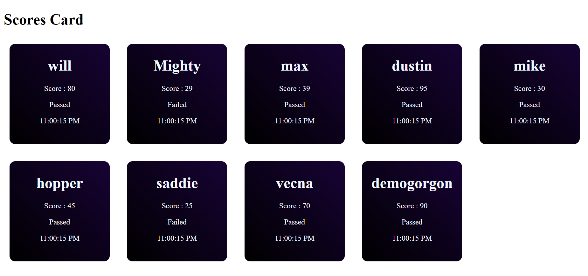

# Scores Card

This displays a collection of student score cards using React, props, and hooks. Each card shows:

- Student name  
- Score  
- Pass/Fail status check  
- A live clock updated every second  

## 👋🏻 Output Image
An output screenshot of the score cards is stored in the `public` folder:

**Path:** `output/output.png`

```md

